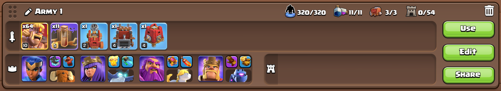

Clash of Clans auto attacker and looter bot
===============================================

This is a bot for the popular mobile game Clash of Clans. It automates attacking and looting resources from other players' villages so you can max out your walls without spending hours playing the game.

Features
--------
- Automated attacking of enemy villages
- Time optimised attack strategy

Limitations
-----------
- Ratios are only tested for town halls 13-15
- Need to manually drain the storages

Requirements
------------
- Python 3
- pyautogui
- Bluestacks
- Super Barbarians (cost 25k Dark Elixir for 3 days)

Installation
------------
1. Clone the repository
2. Install the required Python packages:
    ```
    pip install -r requirements.txt
    ```
3. Configure the bot settings in `config.py`
4. Open Bluestacks
5. Import the keyboard mapping by clicking on the keyboard icon in the sidebar and selecting "Import layout from file". Choose the `keymap.cfg` file provided in this repository. (Make sure you've selected the coc profile, else it won't work)
6. Open Clash of Clans and use the army configuration by clicking on the following hyperlink: [Army Configuration](https://link.clashofclans.com/en?action=CopyArmy&army=h4p1e40_9-1p2e20_3-2p3e4_5-0p0e10_8u64x26-1x91-1x87-1x75s11x10), which should look like this:
   . Feel free to customise the army composition as long as you're able to 1-star most bases under 20 seconds after deployment.
7. Use the following base layout: [Base Layout](https://link.clashofclans.com/en?action=OpenLayout&id=TH15%3AHV%3AAAAABQAAAALyqvTgqf3LVADJ1UxoSF49)
   Or set up your own base with similar wall placements to the following image:
   . Make sure the walls run diagonally and vertically across the centre of the base.

Usage
-----
- Open Bluestacks and launch Clash of Clans
- Make the Bluestacks window full screen.
- Run the bot:
    ```
    python bot.py
    ```
- You have 5 seconds to switch to the Bluestacks window before the bot starts executing.
- To stop the bot, press `Ctrl + C` in the terminal or drag the mouse to the top-left corner of the screen.
